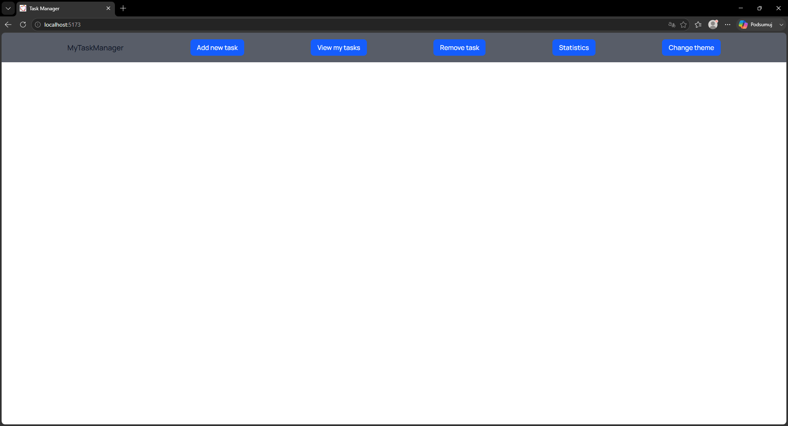
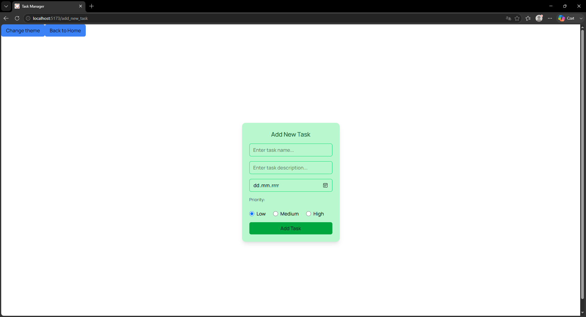
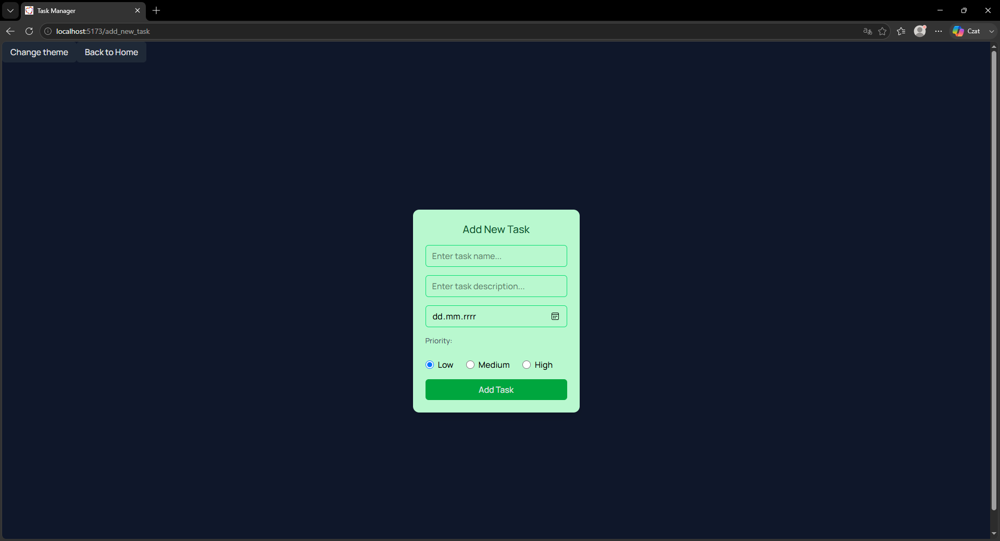
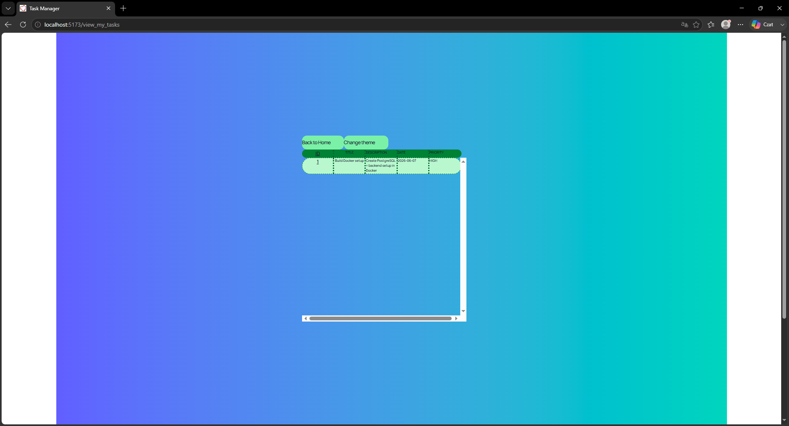
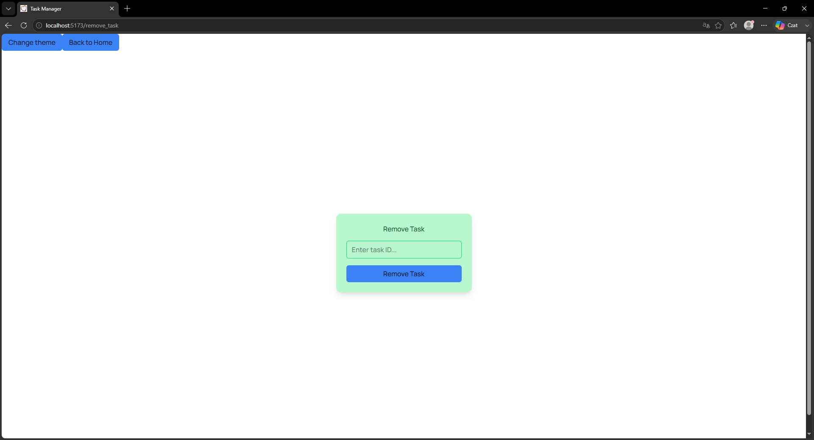
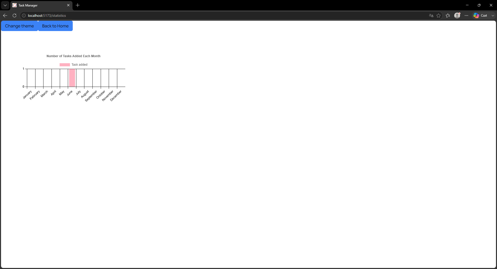

# Task-Manager


A Task Manager is a web application that helps users create, organize, and track their tasks efficiently.


A full-stack Task Manager application built with:
- Spring Boot + Gradle (backend API)
- React + Vite (frontend)
- PostgreSQL (database)
- Docker Compose (development environment)

## Tech Stack
| Layer | Technology |
| ----- | ---------- |
| Backend | Java 21, Spring Boot 3, Gradle |
| Frontend | React, Vite, npm |
| Database | PostgreSQL 17 |
| Containerization | Docker, Docker Compose |

## Requirements
- Docker Desktop

## Quick start
- first time
```
 docker compose up --build
```
- after first run
```
 docker compose up
```

## Preview







